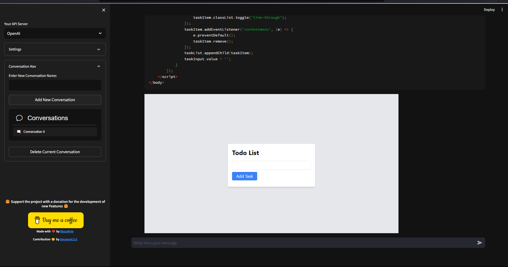

# Gui Streamlit OpenInterpreter
Are you tired of the hassle of running code and having to set up your envinronment for development? Say hello to GuiStreamlitOpenInterpreter, a game-changing project that's designed to help people that don't want to buy a montly suscription and desire to have the advantage of pay as they go to get a smooth experience. With a user-friendly graphical user interface (GUI) powered by Streamlit, you can effortlessly engage with Python, javascrip and others languages without the need for traditional coding to help out begginers.

[](https://openinterpreter.streamlit.app/)

## Table of Contents

- [Introduction](#introduction)
- [Features](#features)
- [Getting Started](#getting-started)
  - [Prerequisites](#prerequisites)
  - [Installation](#installation)
    - [Try it Online](#try-it-online)
    - [Or Try it Locally](#or-try-it-locally)
- [Usage](#usage)
- [Contributing](#contributing)
- [License](#license)

## Introduction

GuiStreamlitOpenInterpreter is a project aimed at simplifying the process of running code and interacting with OpenAI models through a graphical user interface (GUI). With Streamlit as the frontend framework, this tool provides an intuitive way to work with Python and OpenAI applications without needing to write code in a traditional coding environment.

## Features

- User-friendly interface for running Python, java code and others.
- Integration with OpenAI applications for natural language processing and chatbot functionalities.
- Simplified execution of code and interaction with OpenAI models.
- Customizable and extensible for different use cases.

## Getting Started

### Prerequisites

Before you begin, ensure you have met the following requirements:

- [Python](https://www.python.org/) (>= 3.10) installed on your system.
- Dependencies mentioned in the `requirements.txt` file.

### Installation
- **Try it Online**
  
  - No need to insatall
  - [](https://openinterpreter.streamlit.app/)
- **Or Try it Locally**

1. Clone this repository:

   ```bash
   git clone https://github.com/blazzbyte/OpenInterpreterUI.git
   ```

2. Navigate to the project directory:

    ```bash
    cd OpenInterpreterUI
    ```

3. Install the required dependencies using pip:

    ```bash
    pip install -r requirements.txt
    ```
- **Or Try it with Docker**

    ```bash
    make run
    ```

## Usage

1. To run the OpenInterpreterUI, use the following command:
    ```bash
    streamlit run app.py --server.port 8501
    ```
2. Access the application in your web browser at http://localhost:8501.
3. Use the GUI to execute Python code and interact with OpenAI applications.

## Contributing

Contributions are welcome! If you'd like to contribute to this project, please follow these steps:
1. Fork the repository.
2. Create a new branch for your feature or bug fix.
3. Make your changes and commit them with a clear commit message.
4. Push your changes to your fork.
5. Create a pull request to merge your changes into the main repository.

## License

This project is licensed under the MIT License - see the [LICENSE](LICENSE) file for details.
